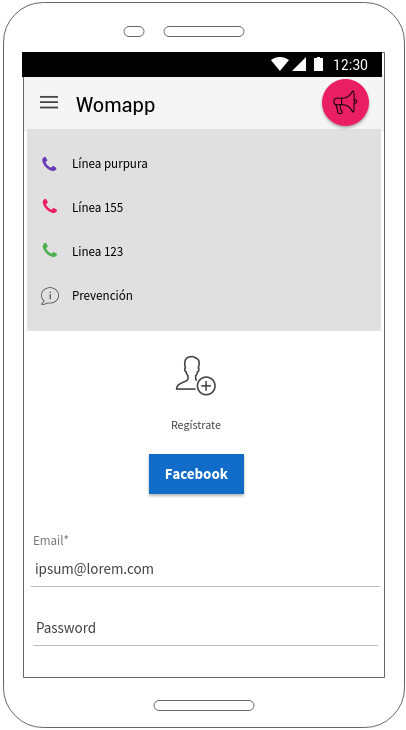
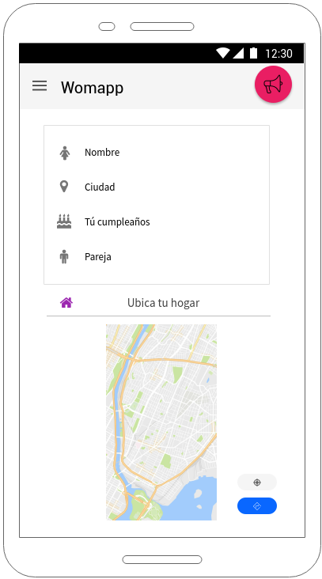
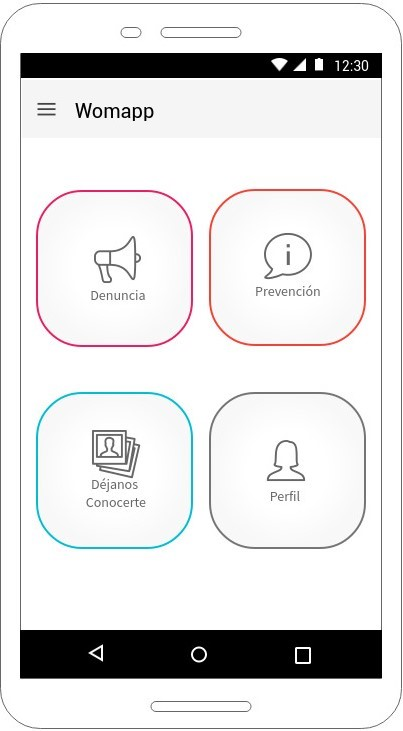
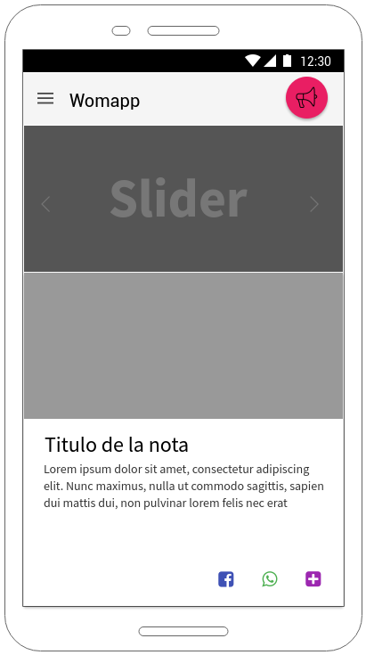

# Violencia contra la mujer
## Introducción
Las localidades de la ciudad de Bogotá presentan actualmente diversos problemas de violencia, delincuencia, drogas, medio ambiente y muchos inconvenientes más. En este momento se necesitan posibles soluciones las cuales de alguna manera deberían ayudar a mitigar un poco estos problemas para que día a día las cosas mejoren. Definitivamente la sociedad necesita ideas nuevas y diferentes puntos de vista para poder observar un cambio en este tipo de problemáticas, verificar y analizar las diferentes ideas suministradas por la comunidad en general. Nosotros como beneficiarios del programa piensa digital programa de formación FullStack y aplicaciones hibridas tenemos el reto de que mediante una aplicación web o móvil ayudemos a mitigar un poco estas problemáticas presentadas en las diferentes localidades. 

Nuestro quipo de trabajo decide tomar como reto la violencia contra la mujer ya que es la problemática mas grave y de gran alarma últimamente por las frecuentes agresiones y muertes hacia las mujeres; pero para dar un comienzo a este reto debemos tener clara la problemática y un concepto conciso de lo que hablamos.

La violencia contra las mujeres es la manifestación extrema de la desigualdad y del sometimiento en el que viven las mujeres en el mundo. Constituye un atentado contra el derecho a la vida, a la seguridad, a la libertad, y la dignidad de las mujeres y, por lo tanto, un obstáculo para el desarrollo de una sociedad democrática. También es una violación de los derechos humanos que causa sufrimientos, acaba vidas, y deja incontables mujeres viviendo con dolor y temor en todos lados. La violencia contra la mujer les impide alcanzar su plena realización personal, restringe el crecimiento económico y obstaculiza el desarrollo. La generalización y el alcance de la violencia contra la mujer ponen de manifiesto el grado y la persistencia de la discriminación con que siguen tropezando las mujeres. Por lo tanto, sólo se puede eliminar tratando de minimizar la discriminación, promoviendo la igualdad y el empoderamiento de la mujer y velando por el pleno ejercicio de los derechos humanos de la mujer.

Para el presente reto según el mapa de empatía describimos a nuestro parecer lo que dicen, piensan, hacen y sienten los hombres y las mujeres en cuanto a los hechos de violencia contra la mujer. 

Nos enfocamos en dos ámbitos diferentes los cuales describimos así:

###### Lo que dicen:
 
- **Mujeres**
  - Le tengo miedo
  - Él va a cambiar
  - Yo le dí motivos
  - Estaba enojado
  - Me aguanto por mis hijos

- **Hombres**
  - Yo mando
  - Ella es mía
  - Yo soy el que aporta
  - Sexo débil
  - Ella no me va a dominar

###### Lo que piensan:
 
- **Mujeres **
  - La próxima lo denuncio
  - Que se muera
  - Me llevo a mis hijos
  - Es que yo lo amo
  - No quiero destruir mi hogar
- **Hombres**
  - Ella nunca se va a ir
  - Yo le pego porque la amo
  - Así me criaron
  - Yo tengo el derecho
 
###### Lo que hacen:
 
- **Mujeres **
  - Callar
  - Evitar salir
  - Defender y justificar a su agresor
- **Hombres**
  - Actuar como si nada hubiese pasado
  - Compensar con regalos
  - Se burlan de su victima
 

###### Lo que sienten:
 
- **Mujeres **
  - Dolor
  - Impotencia
  - Miedo
  - Frustración
  - Resentimiento
- **Hombres**
  - Virilidad
  - Superioridad
  - Satisfacción
  - Percepción de control

De acuerdo a nuestra forma de ver las cosas explicaríamos en este caso como podríamos disminuir un poco de acuerdo a nuestra manera de ver las cosas la violencia contra la mujer.

## Problemática
La problemática de las diferentes localidades se origina en que siguen existiendo hombres que se aprovechan de su fuerza para vulnerar los derechos de niñas y mujeres. Actos de machismo siguen ocurriendo en la vida diaria alimentando la violencia intrafamiliar en los hogares de la ciudad.

## Alcance
La expectativa de los habitantes se basa en aumentar la sensibilización hacia la ciudadanía para que pueda actuar firmemente ante cualquier abuso hacia la mujer, para que denuncie activamente los casos de violencia y se proteja la integridad de las madres cabeza de familia. También es esencial educar adecuadamente a los hombres para que cambien sus inaceptables comportamientos

## Informe
1. Se identifican los diferentes retos que nos presentan en diferentes localidades para leerlos y poder ponernos de acuerdo en cual vamos a trabajar.
2. Se realiza una selección de 4 retos diferentes y se escoge uno solo por votación de los integrantes del grupo.
3. Se escoge el reto que más nos llama y con el cual nos sentimos más cómodos para trabajar.
4. Se realiza una actividad sobre el mapa de empatía en donde identificamos lo que dicen, piensan, hacen y sienten los hombres y mujeres en cuanto a la violencia contra la mujer, los perfiles de los agresores y de las víctimas.
5. Se escogen como los puntos mas importantes de los analizados en el mapa y se explica como se puede dar solución o ayudar a mitigar cada caso. Y para esto se crea un sketch en donde presentamos nuestra manera de dar soluciones a varios de estos inconvenientes en algunas pantallas.

#### Pantalla 1

- En la pantalla principal se da la opción de hacer llamadas directas a la línea purpura, línea 155 y la línea 123 de la policía nacional. Esto se realiza con el fin de dar como una solución a que las mujeres callen y no denuncien. Con esta aplicación tendrán a la mano diferentes formas de denunciar sin tener que movilizarse a ningún lugar y no tener excusas de porque no denuncian.
- Se da la opción de registrarse por medio de Facebook para que simplemente se manejen los mismos datos en la aplicación y no tenga que llenar formularios de registro.

#### Pantalla 2

- En la segunda pantalla se encuentran los datos principales de la mujer que se registra y en donde pueden ubicar la dirección de la casa de cada persona y quedará registrada en caso de emergencias y la cual será enviada como alerta por si la mujer se encuentra en peligro y utiliza el botón que se encuentra en la parte superior derecha de la pantalla. Con esto se busca enviar una alerta a la policía y por medio de una confirmación de peligro de la mujer la policía llegara al lugar registrado en la aplicación.

#### Pantalla 3

- En otra de las pantallas se dan 4 opciones en las cuales también se trata de mitigar de alguna los miedos y las posibilidades de que las mujeres no callen y denuncien de manera privada y sin temor en cualquier momento.

#### Pantalla 4

- En esta pantalla se pueden ver las campañas y noticias de diferentes entidades en donde se esta en contra de la violencia contra la mujer en donde se concientiza a la gente de este gran problema.